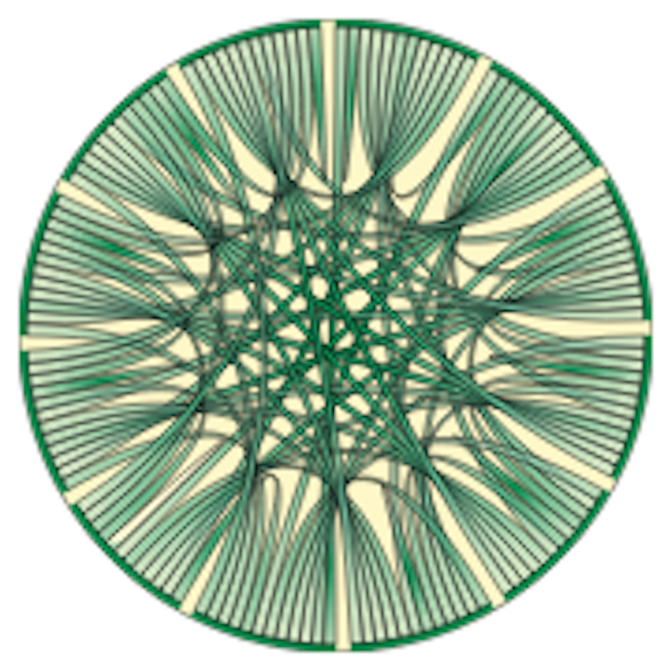

.. Doc Website documentation master file, created by
   sphinx-quickstart on Sat Feb 17 13:22:50 2018.
   You can adapt this file completely to your liking, but it should at least
   contain the root `toctree` directive.

Stenglein Lab Standard Taxonomic Assessment Pipeline Documentation
==================================================================

This is a description of the website. Fill in more information later.

.. toctree::
   :maxdepth: 2
   :caption: Contents:

   summary
   Software_Requirements
   Installation
   Usage
   ex
   ref
   contact

    `The Stenglein Lab <http://www.stengleinlab.org/>`_

